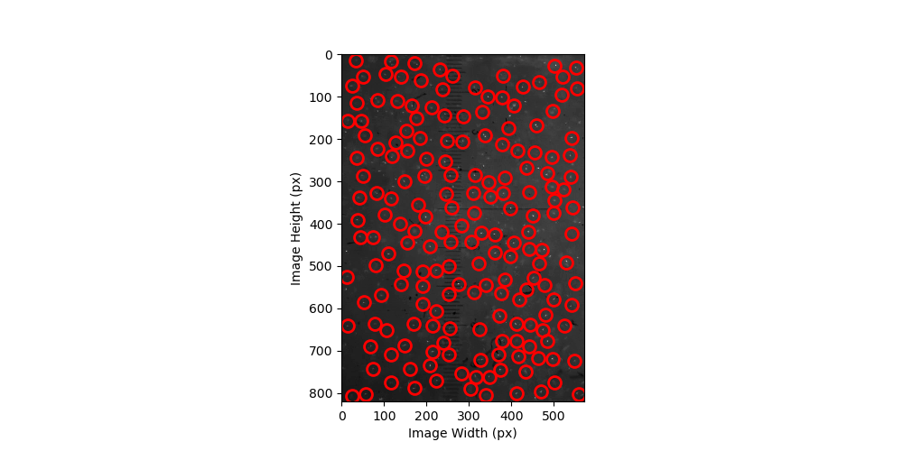

## Millikan Oil Drop Experiment Tracker
Millikan Oil Drop Experiment requires repetitive particle tracking job. This process is very likely be affected by human-error due to handpicking oil droplets. Thus, automated tracker will reduce the error and collect much larger dataset leading to unbiased result of the experiment.
## Description
This project consist of three parts. First, it tracks particles through extract.py, then it scales the data into actual velocity through transform.py. Finally, calculator.py calculate the velocities, radius, and charge of the droplets.
## Installation
Install Python and install all required libraries imported in all three codes. First run extract.py, which will locate and track particles in the video. Then transform.py will scale the data. The scaled data will be processed into final data through calculator.py.
## Screenshot

## Credits
#### Original Code: https://github.com/ricktjwong/millikan
#### Code Modifications:
Hyun W. Anderson: Made significant modifications to the original codebase.

John Kim : Assisted in the modifications and improvements.
